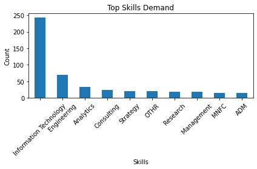
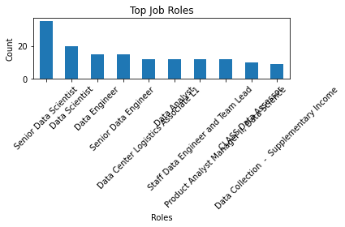
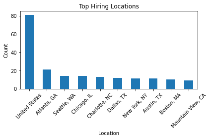
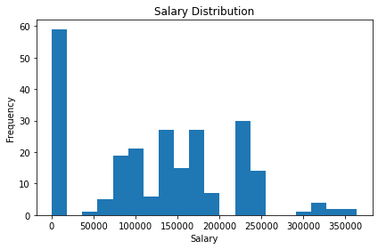

# Job Market Analysis using Python

## 📌 Objective

This project analyzes job market data to identify the most in-demand skills, job roles, locations, and salary trends in the data field.

## 🛠 Tools Used

* Python
* Pandas
* Matplotlib

## 📊 Key Insights

* Information Technology and Engineering dominate job demand
* Analytics roles are growing in the market
* United States and cities like Atlanta, Seattle show high hiring activity
* Median salary ranges between 90k–135k, with higher roles exceeding 300k

## 📈 Visualizations

### Top Skills

### Top Job Roles

### Top Locations

### Salary Distribution

## 📁 Files in this Project

* `job_analysis.ipynb` → Data analysis notebook
* `processed_jobs_small.csv` → Cleaned dataset
* `*.png` → Visualization outputs

## 🚀 Conclusion

This project highlights current trends in the data job market and helps understand which skills and roles are most valuable.

## 👩‍💻 Author

Nilarini Devaraj
